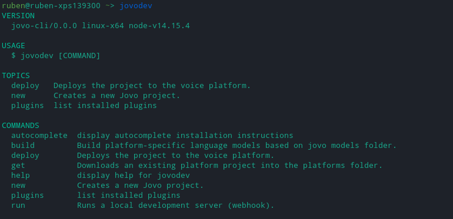

# Jovo CLI

> To view this page on the Jovo website, visit https://www.jovo.tech/marketplace/jovo-cli

The Jovo CLI (GitHub Repository: [jovotech/jovo-cli](https://github.com/jovotech/jovo-cli)) is the center of voice app development with the Jovo Framework. With it, you can quickly create new Jovo projects, create language models and deploy them to the voice platforms, and run your voice apps locally for easy prototyping and testing.

:exclamation: If you don't have access to any of these repositories, please contact ruben@jovo.tech. :exclamation:

- [Jovo Filebuilder](https://github.com/rubenaeg/filebuilder)
- [Template](https://github.com/rubenaeg/jovo-template-dev)
- [Jovo CLI](https://github.com/rubenaeg/jovo-cli)
- [Jovo Framework](https://github.com/rubenaeg/jovo-framework)

---

- [Development Setup](#development-setup)
  - [Install the Jovo Filebuilder](äinstall-the-jovo-filebuilder)
  - [Download the template for `jovo new`](#download-the-template-for-jovo-new)
  - [Install the Jovo CLI](#install-the-jovo-cli)
  - [Setup Platform CLI Plugins from the Jovo Framework](#setup-platform-cli-plugins-from-the-jovo-framework)
- [Usage](#usage)
- [Troubleshooting](#troubleshooting)

## Development Setup

To configure the Jovo CLI for development, you'll need to complete a few steps before actually installing the CLI itself.

### Install the Jovo Filebuilder

Since the Jovo Filebuilder is not yet registered on NPM, you have to install and link it by yourself.

```sh
# Clone the Jovo Filebuilder
# 	with SSH.
$ git clone git@github.com:rubenaeg/filebuilder.git
# 	with HTTPS.
$ git clone https://github.com/rubenaeg/filebuilder.git
# 	with the GitHub CLI.
$ gh repo clone rubenaeg/filebuilder

# Switch directories.
$ cd filebuilder/

# Run the NPM script devSetup, which will install dependencies, compile TypeScript and link the package, so it is available globally on your machine.
$ npm run setup:dev
```

### Download the template for `jovo new`

`jovo new` currently uses a template folder to create new projects from. If you run `jovo new`, it's important that your working directory is the parent directory of the template repo, otherwise the CLI won't find the folder, resulting in an error.

```sh
# Clone the template
# 	with SSH.
$ git clone git@github.com:rubenaeg/jovo-template-dev.git
#		with HTTPS.
$ git clone https://github.com/rubenaeg/jovo-template-dev.git
# 	with the GitHub CLI.
$ gh repo clone rubenaeg/jovo-template-dev
```

### Install the Jovo CLI

Now that you completed all prerequisites, you can go on and install the Jovo CLI.

```sh
# Clone the Jovo CLI
# 	with SSH.
$ git clone git@github.com:rubenaeg/jovo-cli.git
# 	with HTTPS.
$ git clone https://github.com/rubenaeg/jovo-cli.git
# 	with the GitHub CLI.
$ gh repo clone rubenaeg/jovo-cli

# Switch directories.
$ cd jovo-cli/

# Switch branch to v4.
$ git checkout v4

# Run the NPM script setup:dev, which will install dependencies, compile TypeScript and link all necessary packages.
$ npm run setup:dev
```

### Setup Platform CLI Plugins from the Jovo Framework

With v4 of the Jovo CLI, CLI plugins (e.g. for platforms such as Amazon Alexa) sit in their respective folder inside the Jovo Framework. So, to use those plugins, you'll need to download the Jovo Framework and set them up for local use.

```sh
# Clone the Jovo Framework
#   with SSH.
$ git clone git@github.com:rubenaeg/jovo-framework.git
#   with HTTPS.
$ git clone https://github.com/rubenaeg/jovo-framework.git
#   with the GitHub CLI.
$ gh repo clone rubenaeg/jovo-framework

# Switch directories.
$ cd jovo-framework

# Switch the current branch.
$ git checkout v4dev

# Run the NPM script setup:dev, which will install dependencies, compile TypeScript and link all necessary packages.
$ npm run setup:dev
```

## Usage

Once you installed everything, run `jovodev` to confirm everything is working. The output should look similar to this:



If you want help with any command, just type `jovodev {COMMAND} --help`.

## Troubleshooting

If the CLI reports that it can't find a command, try deleting your `~/.jovo/config`, as the new Jovo CLI comes with some updates to the configuration structure.
